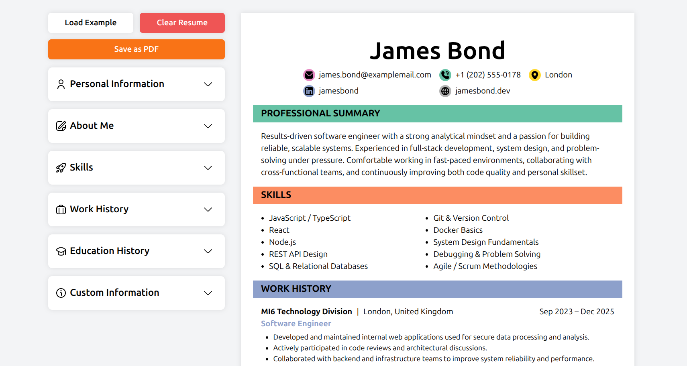

# CV Application

A single-page CV (resume) application built with React, designed to practice component-based architecture, state management, and controlled form inputs. The app allows users to create, edit, and preview a CV in real time, focusing on clean UI and predictable data flow.

## Preview



**Live Demo:**
- GitHub Pages | [CV-Application](https://wrzdx.github.io/CV-Application/)
- Vercel | [CV-Application](https://cv-application-ks50jdu5d-wrzdxs-projects-db4f0ec3.vercel.app/)

## Features

* Real-time CV preview while editing form fields
* Editable sections: personal info, professional summary, skills, work experiences and educations
* Component-based architecture with React
* Controlled inputs and lifted state for predictable updates
* Clean, minimal UI focused on readability
* Responsive layout for desktop and mobile devices

## How to Run

1. Clone the repository:

```bash
git clone https://github.com/wrzdx/CV-Application.git
```

2. Install dependencies:

```bash
npm install
```

3. Start development server:

```bash
npm run dev
```

4. Open `http://localhost:5173` in your browser

For production build:

```bash
npm run build
```

---

_Part of The Odin Project's Full Stack JavaScript Curriculum_
_Focuses on React fundamentals, state management, and component-driven UI design_
